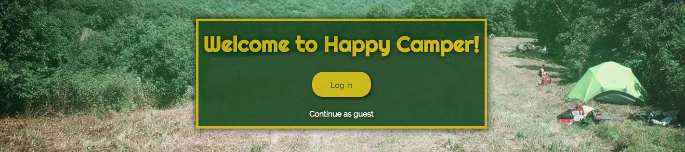

# Happy Camper

## Description

Happy Camper is an app that assists the user with finding nearby places to hang out outdoors.  It gives users weather information for all the nearby locals so that they can make an educated choice about how enjoyable their trip will be.

## Important project links

* Wireframe: https://marvelapp.com/je7c0eg

* ERD: https://docs.google.com/document/d/1JrXHQwzNdDvR3XMQ6VEhDQrvFoohzN6DoSRXYdJnco8/edit?usp=sharing

* Trello: https://trello.com/b/wprBpADM/wdi-project-4

* Github: https://github.com/whuizenga/Happy-Camper

* Heroku: https://happy-camper-app.herokuapp.com/

### Technologies used

* React on Rails

* Devise

* google-maps-react

### Apis used

* Google Maps

* Darksky

* Active

## Future development

There are many things that I would like to add in the future.  User reviews of locations, being able to search by location name, or filter results by what activities are available.
